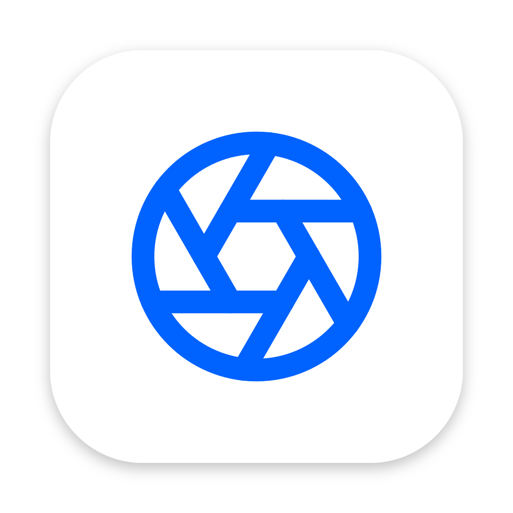

<p align="center">
  
</p>

<h1 align="center">OptiShot</h1>

<p align="center">
  <strong>내 사진을 내 규칙으로, 안전하게 정리하는 로컬 데스크톱 도구</strong>
</p>

<p align="center">
  
  
  
  
  
</p>

---

## Why OptiShot?

스마트폰, NAS, 외장 하드, 클라우드 백업... 수년간 쌓인 사진은 어느새 수만~수십만 장.
같은 사진이 여러 곳에 복제되고, 보정본과 원본이 뒤섞이며, 어떤 것이 가장 좋은 버전인지 알 수 없게 됩니다.

**OptiShot**은 이 문제를 해결합니다.

- **2단계 이미지 해싱**으로 육안으로 구분 어려운 유사/중복 사진까지 감지
- **품질 평가 알고리즘**으로 가장 선명한 버전을 자동 추천
- **파일 정리** — 촬영 날짜 기준으로 파일명을 일괄 변경하고, 되돌리기도 가능
- **100% 로컬 처리** — 사진이 절대 외부 서버로 전송되지 않습니다
- **Soft Delete 안전 정책** — 원본 파일을 직접 삭제하지 않으며, 30일간 복원 가능

---

## Key Features

### Duplicate Detection (2-Stage Plugin Architecture)

단순한 해시 비교가 아닌, **2단계 검증 파이프라인**으로 정밀도와 속도를 모두 확보합니다.
감지 알고리즘은 `DetectionPlugin` 인터페이스로 교체 가능합니다.

| Stage | Algorithm | Purpose |
|-------|-----------|---------|
| **Stage 1** | pHash + BK-Tree | DCT 기반 Perceptual Hash로 빠른 후보 추출. BK-Tree 인덱싱으로 O(log n) 검색 |
| **Stage 2** | SSIM | Structural Similarity 검증으로 오탐 제거. 휘도/대비/구조 3채널 비교 |

- **pHash Threshold**: Hamming Distance 기반 (기본 8, 4~16 조절 가능)
- **SSIM Threshold**: 구조적 유사도 (기본 0.82, 0.5~0.95 조절 가능)
- **Plugin Registry**: 내장 pHash-SSIM 외 커스텀 플러그인 확장 가능
- 플러그인별 임계값 UI 분리 (PluginSection)

### Quality Scoring

중복 그룹 내에서 **가장 좋은 버전(Master)**을 자동 선별합니다.

- **Laplacian Variance** — 이미지 선명도 평가 (blur 감지)
- **해상도** — 높은 해상도 우선
- **파일 크기** — 원본 품질 보존 여부 판단
- **EXIF 메타데이터** — 촬영 정보 보존 여부 가점

### File Organizer

촬영 날짜 기준으로 파일명을 일괄 변경합니다.

- 네이밍 규칙: `YYYY-MM-DD_HHmmss.ext` (충돌 시만 `_001` seq 추가)
- 날짜 소스: EXIF DateTimeOriginal > CreateDate > 파일 생성일 > 수정일
- 미리보기에서 변경 전/후를 확인하고 실행
- 되돌리기 지원 (직전 1회, DB 저장)
- 설정에서 정리 이력 초기화 가능

### EXIF Pre-Scan Filtering

수십만 장의 사진을 스캔하기 전에, EXIF 메타데이터로 **대상 파일을 사전 필터링**합니다.

| Filter | Description |
|--------|-------------|
| 촬영 날짜 범위 | 특정 기간의 사진만 스캔 |
| 카메라 모델 | 특정 카메라로 촬영한 사진만 포함 |
| GPS 유/무 | 위치 정보 포함/미포함 사진 선택 |
| 최소 해상도 | 일정 크기 이하 이미지 제외 |

### Dark Mode

Light / Dark / Auto 3가지 테마를 지원합니다. Auto 모드는 시스템 설정을 따릅니다.

### Notification System

3계층 알림 아키텍처로 앱 내 활동을 추적합니다.

- 로그 파일 (영구, JSON Lines)
- EventBus (실시간 UI 알림)
- 인메모리 store (세션)
- CQRS 미들웨어 정책: 명령별 알림 규칙 자동 적용

### Safety First

사진은 되돌릴 수 없는 소중한 자산입니다. OptiShot은 **안전을 최우선**으로 설계되었습니다.

- 원본 파일을 직접 수정하거나 삭제하지 않음
- Soft Delete: 휴지통으로 이동 (복사 후 삭제)
- 30일 보관 후 영구 삭제 (자동 정리 스케줄러)
- 글로벌 에러 핸들러 — 에러가 앱 크래시로 이어지지 않음
- 100% 로컬 — 네트워크 호출 없음, 클라우드 전송 없음

---

## Screenshots

> *Coming soon*

---

## How It Works

```
┌────────────────────────────────────────────────────────────┐
│                      OptiShot Pipeline                      │
├────────────────────────────────────────────────────────────┤
│                                                            │
│  1. Folder Selection                                       │
│     └─ 스캔 대상 폴더 선택 (다중, 하위폴더 포함 옵션)         │
│                                                            │
│  2. EXIF Pre-Filter (Optional)                             │
│     └─ 날짜/카메라/GPS/해상도로 대상 파일 사전 축소            │
│                                                            │
│  3. Stage 1: pHash + BK-Tree                               │
│     └─ DCT 기반 64-bit 해시 생성 → BK-Tree 범위 검색         │
│     └─ Hamming Distance ≤ threshold → 후보 그룹 생성        │
│                                                            │
│  4. Stage 2: SSIM Verification                             │
│     └─ 후보 그룹 내 구조적 유사도 정밀 검증                   │
│     └─ 오탐 제거, 최종 중복 그룹 확정                         │
│                                                            │
│  5. Quality Scoring                                        │
│     └─ Laplacian 분산 + 해상도 + 메타데이터 기반 점수         │
│     └─ 그룹 내 Master (최적 버전) 자동 선정                   │
│                                                            │
│  6. Group Review                                           │
│     └─ Side-by-side 비교, EXIF 상세, 대표 사진 선택          │
│     └─ 사용자 최종 판정 (Keep All / Delete Duplicates)       │
│                                                            │
│  7. Cleanup                                                │
│     └─ Soft Delete → 30일 보관 → 자동 정리                  │
│                                                            │
│  + File Organizer (독립 기능)                               │
│     └─ 촬영일 기준 일괄 리네임 + 되돌리기                     │
│                                                            │
└────────────────────────────────────────────────────────────┘
```

---

## Supported Formats

| Category | Extensions |
|----------|-----------|
| Standard | `.jpg`, `.jpeg`, `.png`, `.webp`, `.bmp`, `.gif` |
| RAW-adjacent | `.tiff`, `.tif` |
| Apple | `.heic`, `.heif` (자동 변환 + 캐싱) |

---

## Performance Targets

| Metric | Target |
|--------|--------|
| 200K images full scan | < 30 minutes |
| 1K images Stage 1 (pHash) | < 10 seconds |
| 100 groups Stage 2 (SSIM) | < 5 seconds |
| Detection rate | 95%+ |
| False positive rate | < 5% |

---

## Getting Started

### Prerequisites

- [Node.js](https://nodejs.org/) >= 22
- [Bun](https://bun.sh/) >= 1.3

### Installation

```bash
# Clone the repository
git clone https://github.com/shockzinfinity/opti-shot.git
cd opti-shot

# Install dependencies
bun install

# Start development server
bun run dev
```

### Build

```bash
# macOS (.dmg)
bun run build:mac

# Windows (.exe installer)
bun run build:win

# Linux (.AppImage)
bun run build:linux
```

---

## Scripts

| Command | Description |
|---------|-------------|
| `bun run dev` | Electron + Vite dev server (HMR) |
| `bun run build` | Production build |
| `bun run test` | Unit tests (Vitest) |
| `bun run test:watch` | Unit tests in watch mode |
| `bun run test:e2e` | E2E tests (Playwright) |
| `bun run lint` | ESLint |
| `bun run build:mac` | Build .dmg |
| `bun run build:win` | Build .exe installer |
| `bun run build:linux` | Build AppImage |

---

## Tech Stack

| Layer | Technology | Purpose |
|-------|-----------|---------|
| **Runtime** | Electron 41 (Node 22) | Cross-platform desktop |
| **Frontend** | React 19 + TypeScript 6 | UI framework |
| **Styling** | Tailwind CSS 4 | Utility-first CSS + dark mode |
| **State** | Zustand | Lightweight state management |
| **Database** | better-sqlite3 + Drizzle ORM | Embedded SQL with type-safe ORM (8 tables) |
| **Image** | sharp (libvips) | pHash, SSIM, thumbnails, HEIC conversion |
| **EXIF** | exifr | Metadata extraction (GPS, camera, date) |
| **Build** | Vite 7 + electron-vite | Fast HMR + production bundling |
| **Package** | electron-builder | Cross-platform installers + auto-update |
| **Test** | Vitest + Playwright | Unit (181 tests) + E2E |
| **i18n** | Custom (ko/en/ja) | 3-language support |

---

## Architecture

### IPC: CQRS Pattern

개별 IPC 채널 대신, **3개의 타입 안전한 버스**로 통신합니다.

```
Renderer (React)                          Main (Node.js)
  │                                         │
  ├── command('scan.start', opts) ────────► CommandBus (26) → notificationMiddleware → Handler → Service
  ├── query('group.list', params) ────────► QueryBus   (18) → Handler → Service
  └── subscribe('scan.progress')  ◄──────── EventBus    (6) → BrowserWindow.send
```

**이중 검증 보안:**
1. **Preload**: Type allowlist 검증 (허용된 command/query/event만 통과)
2. **Main IpcBridge**: Zod 스키마로 payload 구조 검증

### Screens

| Route | Screen | Description |
|-------|--------|-------------|
| `/` | Dashboard | 통계, 최근 스캔/정리, 빠른 실행 |
| `/folders` | Folder Select | 스캔 대상 폴더 + 모드 + 필터 + 고급 설정 |
| `/scan` | Scan Progress | 실시간 진행률 + 발견 그룹 |
| `/review` | Group Review | Side-by-side 비교 + 판정 |
| `/trash` | Trash | 30일 보관 + 복원/영구삭제 |
| `/organize` | File Organizer | 촬영일 기반 일괄 리네임 + 되돌리기 |
| `/settings` | Settings | 스캔/UI/데이터 설정 (4탭) |

### Security

| Feature | Status |
|---------|--------|
| `contextIsolation` | `true` — Renderer에서 Node.js API 접근 차단 |
| `nodeIntegration` | `false` — 원격 코드 실행 방지 |
| `sandbox` | `true` — Renderer 샌드박스 격리 |
| Navigation guard | 외부 URL 이동 차단 |
| Preload | `contextBridge`를 통한 선택적 API 노출 |

### Project Structure

```
src/
├── main/                # Electron Main Process
│   ├── cqrs/            # CQRS infrastructure
│   │   ├── commandBus.ts    # 26 commands (state changes)
│   │   ├── queryBus.ts      # 18 queries (data reads)
│   │   ├── eventBus.ts      # 6 events (Main→Renderer push)
│   │   ├── ipcBridge.ts     # IPC entry (dual validation)
│   │   ├── schemas.ts       # Zod payload schemas
│   │   ├── notificationMiddleware.ts  # Auto-notification via policy
│   │   └── handlers/        # Domain handlers (13 modules)
│   ├── db/              # Drizzle schema (8 tables) & migrations
│   ├── engine/          # BK-Tree, pHash, SSIM, quality scoring
│   │   └── plugins/     # DetectionPlugin implementations
│   ├── services/        # Business logic (scan, organize, trash, notification, ...)
│   └── scheduler/       # Trash cleanup scheduler
├── renderer/            # React App (Renderer Process)
│   ├── components/      # Reusable UI (FolderPicker, ActionBar, ...)
│   ├── pages/           # 7 route-based screens
│   ├── stores/          # Zustand stores
│   ├── hooks/           # Custom hooks (useTheme, useTranslation, ...)
│   └── i18n/            # ko, en, ja translations
├── shared/              # Types shared between processes
│   ├── types.ts         # Domain types
│   ├── constants.ts     # Single-source constants
│   ├── utils.ts         # Shared format functions
│   └── cqrs/            # Type registries (CommandMap, QueryMap, EventMap)
└── preload/             # contextBridge API
```

---

## Algorithms Deep Dive

### pHash (Perceptual Hash)

```
Input Image → Grayscale → Resize 32x32 → DCT → Top-left 8x8 → Median → 64-bit Hash
```

- DCT(Discrete Cosine Transform) 기반으로 이미지의 저주파 특성 추출
- 크기 변경, 밝기 조절, 경미한 편집에도 유사한 해시 생성
- 64-bit 해시 간 Hamming Distance로 유사도 측정

### BK-Tree (Burkhard-Keller Tree)

- 메트릭 공간에서의 효율적 범위 검색 트리
- 삽입: O(log n), 검색: O(log n) 평균
- 200K 해시에서 threshold 이내의 모든 후보를 빠르게 검색

### SSIM (Structural Similarity Index)

```
SSIM(x, y) = [l(x,y)]^α · [c(x,y)]^β · [s(x,y)]^γ

l = luminance comparison (휘도)
c = contrast comparison (대비)
s = structure comparison (구조)
```

- 인간의 시각 인지 모델 기반
- 단순 픽셀 비교보다 체감 유사도에 가까운 결과
- pHash 후보에 대해서만 실행하여 연산량 제어

### Quality Score

```
Score = w1 × LaplacianVariance + w2 × Resolution + w3 × FileSize + w4 × MetadataBonus
```

- **Laplacian Variance**: 엣지 강도 기반 선명도 (높을수록 선명)
- **Resolution**: 픽셀 수 (가로 × 세로)
- **FileSize**: 압축 품질 간접 지표
- **Metadata Bonus**: EXIF 보존 여부 가점

---

## Design System

| Token | Light | Dark |
|-------|-------|------|
| Primary | `#0062FF` | `#4D8EFF` |
| Surface | `#FFFFFF` / `#F7F8FA` | `#121317` / `#1C1D24` |
| Text | `#1A1A1A` | `#E8EAED` |
| Heading Font | Geist (600+) | |
| Body Font | Inter (400-500) | |
| Mono Font | Geist Mono | |
| Icons | lucide-react | |
| Style | Soft Bento + Electric Cobalt | |

---

## Internationalization

3개 언어를 기본 지원합니다.

| Language | Code | Status |
|----------|------|--------|
| 한국어 | `ko` | Default |
| English | `en` | Complete |
| 日本語 | `ja` | Complete |

설정 페이지에서 실시간 전환 가능.

---

## Roadmap

현재 핵심 기능이 완료된 상태이며, 다음 항목들이 계획되어 있습니다.

| Phase | Feature | Status |
|-------|---------|--------|
| v0.2 단기 | Auto-updater 실전 배포 | 코드 있음, 배포 미완 |
| v0.2 단기 | Incremental Scan | 설계 논의 필요 |
| v0.2 단기 | dHash+MSE 플러그인 | 가이드 완료, 구현 대기 |
| v0.2 단기 | 다중 플러그인 동시 실행 | 기획 |
| v0.3 중기 | Worker Threads 병렬 처리 | stub |
| v0.3 중기 | 다중 회전 pHash 플러그인 | 기획 |
| v0.4+ 장기 | ORB / 딥러닝 플러그인 | 기획 |
| v0.4+ 장기 | 지도 기반 위치 필터링 | GPS 데이터 있음 |
| v0.4+ 장기 | EXIF 메타데이터 편집 | 아이디어 |
| 인프라 | GitHub Actions CI/CD | 미구현 |
| 인프라 | 코드 서명 (Apple/Windows) | 미구현 |

상세 로드맵: [docs/ROADMAP.md](docs/ROADMAP.md)

---

## Contributing

```bash
# Fork & Clone
git clone https://github.com/YOUR_USERNAME/opti-shot.git
cd opti-shot

# Install
bun install

# Development
bun run dev

# Run tests before PR
bun run test
bun run lint
```

---

## License

[MIT](LICENSE)

---

<p align="center">
  <sub>Built with Electron, React, and sharp. 100% local, zero cloud.</sub>
</p>
