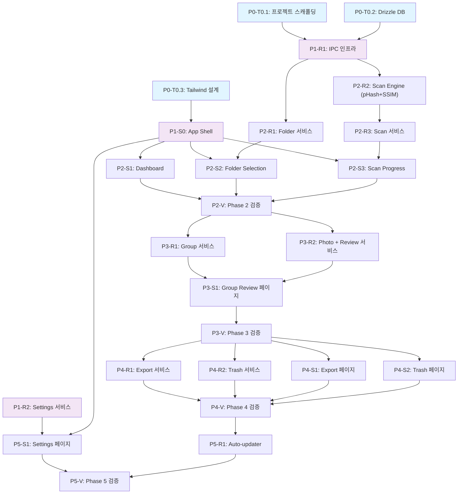

# 06-tasks.md — OptiShot Electron Phase Breakdown

## メタ情報
- **프로젝트**: OptiShot — Electron + React + TypeScript 사진 중복 감지 도구
- **생성일**: 2026-04-17
- **총 Phase**: 6개 (P0-P5)
- **총 Task**: 26개
- **분기 구조**: Feature Branch Per Phase (specialist가 구현, orchestrator가 병합)
- **Stitch Design URL**: https://stitch.withgoogle.com/p/977412230907375002

---

## 의존성 그래프 (Mermaid)

---

## Phase 0: 프로젝트 설정 (Contract & Foundation)

### 메타: 초기화 작업
- 모든 팀이 참고할 기초 환경 구성
- P0 완료 → P1+ 병렬 개발 진행
- 담당: frontend-specialist (P0-T0.1, P0-T0.3), backend-specialist (P0-T0.2)

---

### [x] P0-T0.1: Electron + Vite 프로젝트 스캐폴딩
- **담당**: frontend-specialist
- **의존**: 없음
- **설명**:
  - electron-vite 템플릿 초기화
  - React 19 + TypeScript + Tailwind CSS 스택 설정
  - 프로젝트 구조 확립: `src/main`, `src/renderer`, `src/shared`, `src/preload`
  - ESLint + Prettier 구성
  - Vitest 설정 (unit test base)
  - Electron 개발 서버 실행 가능 확인
- **파일**:
  - 구현: `package.json`, `vite.main.config.ts`, `vite.renderer.config.ts`, `tsconfig.json`, `.eslintrc.json`, `.prettierrc.json`
  - 테스트: 프로젝트 구조 유효성 테스트 (파일 존재 확인)
- **완료 조건**:
  - `npm run dev` 실행 → Electron 창 표시 (빈 React 앱)
  - 모든 TypeScript 파일 컴파일 성공
  - ESLint 통과
- **Notes**:
  - Electron Main: Node.js, contextIsolation=true, nodeIntegration=false
  - Renderer: 표준 React 빌드, HMR 지원

---

### [x] P0-T0.2: 데이터베이스 스키마 & Drizzle ORM 설정
- **담당**: backend-specialist
- **의존**: 없음
- **설명**:
  - better-sqlite3 + Drizzle ORM 초기화
  - resources.yaml의 16개 엔티티를 Drizzle 스키마로 변환
  - 순환 참조 처리: `groups.masterId` ↔ `photos.groupId`는 nullable FK 사용
  - 마이그레이션 시스템 구축 (`src/main/db/migrations`)
  - DB 연결 관리자 (싱글톤)
  - 테스트 DB 고립 전략
- **파일**:
  - 구현:
    - `src/main/db/schema.ts` (모든 테이블 정의)
    - `src/main/db/index.ts` (DB 초기화 & 쿼리 헬퍼)
    - `src/main/db/migrations/` (버전 관리)
  - 테스트: `tests/unit/db/schema.test.ts`, `tests/unit/db/connection.test.ts`
- **완료 조건**:
  - 모든 16개 엔티티 스키마 정의
  - DB 마이그레이션 실행 → 테이블 생성 확인
  - Vitest 테스트 통과 (스키마 유효성)
- **Notes**:
  - Drizzle: TypeScript-first, zero-runtime ORM
  - 순환 참조는 onDelete: 'set null' 사용
  - 싱글톤 패턴으로 Main Process에서 단일 connection 관리

---

### [x] P0-T0.3: Tailwind CSS 설계 시스템 구성
- **담당**: frontend-specialist
- **의존**: 없음
- **설명**:
  - Pencil 디자인 시스템 토큰 추출
  - Tailwind config 파일로 변환
  - 색상: Primary #0062FF, Surface #F7F8FA, Text #1A1A1A, Alert/Warning/Success 정의
  - 타이포그래피: Geist (headings, font-weight 600+), Inter (body, 400-500), Geist Mono (data)
  - 스페이싱 스케일: 4px 그리드 (0.5 = 2px, 1 = 4px, ...)
  - 반경 스케일: sm=4px, md=8px, lg=12px, xl=16px
  - 기본 컴포넌트 스타일 정의 (Button variant, Input, Card, Badge)
- **파일**:
  - 구현:
    - `tailwind.config.ts` (전체 설정)
    - `src/renderer/styles/base.css` (기본 스타일)
    - `src/renderer/styles/components.css` (컴포넌트 클래스)
  - 테스트: `tests/unit/tailwind.test.ts` (색상값 유효성)
- **완료 조건**:
  - Tailwind 컴파일 에러 없음
  - 모든 색상/스페이싱 정의 확인
  - 기본 컴포넌트 스타일 적용 가능
- **Notes**:
  - Stitch 디자인에서 HTML 직접 추출 가능 (Tailwind 클래스명)
  - Pencil 파일에서 설계 토큰 참조: design/design-system.pen

---

## Phase 1: 기초 인프라 (Foundation & Routing)

### 메타: Electron + React 기초
- IPC 통신 채널 정의 및 보안 설정
- App Shell (헤더, 라우팅) 구축
- 모든 후속 기능이 의존하는 기반
- Worktree 생성 필수: `worktree/phase-1-foundation`
- Branch: `phase-1-foundation`
- 담당: backend-specialist (P1-R*), frontend-specialist (P1-S*)

---

### [x] P1-R1: IPC 인프라 & Preload 보안 설정
- **담당**: backend-specialist
- **의존**: P0-T0.1, P0-T0.2
- **설명**:
  - Electron contextBridge 구성 (type-safe channel 정의)
  - Main Process IPC 핸들러 등록 패턴
  - Renderer에서 접근 가능한 채널 화이트리스트
  - 보안: contextIsolation=true, nodeIntegration=false 강제
  - Zod를 이용한 IPC payload 입력 검증
  - 공유 타입 정의 (shared/types.ts)
- **파일**:
  - 구현:
    - `src/preload/index.ts` (contextBridge 노출)
    - `src/main/ipc/channels.ts` (핸들러 등록)
    - `src/shared/types.ts` (IPC 타입 계약)
    - `src/main/ipc/validators.ts` (Zod 스키마)
  - 테스트: `tests/unit/ipc/preload.test.ts`, `tests/unit/ipc/validators.test.ts`
- **완료 조건**:
  - Renderer에서 타입-안전한 IPC 호출 가능
  - 잘못된 payload는 검증 실패
  - Electron 보안 정책 적용 확인
- **Notes**:
  - IPC 채널명: `service:method` (예: `settings:get`, `scan:start`)
  - 모든 응답은 `{ success: boolean, data?: T, error?: string }`
  - Preload 스크립트는 메인 프로세스와 격리, contextBridge로만 통신

---

### [x] P1-S0: App Shell & 라우팅
- **담당**: frontend-specialist
- **의존**: P0-T0.3, P1-R1
- **설명**:
  - React Router v6 설정 (7개 라우트)
  - 메인 윈도우 커스텀 타이틀바 (HeaderBar 컴포넌트)
  - App 레이아웃: 헤더 + 콘텐츠 영역
  - 페이지 전환 애니메이션 (fade)
  - Zustand 초기화 (전역 상태 저장소)
  - 라우트 보호 (선택사항)
- **파일**:
  - 구현:
    - `src/renderer/App.tsx` (라우터 구성)
    - `src/renderer/components/HeaderBar.tsx` (타이틀바 + 네비게이션)
    - `src/renderer/pages/` (7개 페이지 placeholder)
  - 테스트: `tests/unit/renderer/App.test.tsx`, `tests/unit/renderer/HeaderBar.test.tsx`
- **완료 조건**:
  - 7개 라우트 모두 네비게이션 가능
  - 타이틀바 렌더링 (Stitch ref: 55e3db6d2f294b1a85d511b679e22074)
  - 페이지 전환 시 헤더 유지
- **Notes**:
  - Stitch Design Reference (Dashboard): 55e3db6d2f294b1a85d511b679e22074
  - 라우트 목록: /, /folders, /scan, /review, /export, /trash, /settings

---

### [x] P1-R2: Settings 서비스 (Main Process)
- **담당**: backend-specialist
- **의존**: P0-T0.2, P1-R1
- **설명**:
  - JSON 파일 기반 설정 관리 (OS별 위치)
  - 경로: macOS `~/Library/Application Support/OptiShot/settings.json`, Windows `%APPDATA%/OptiShot/`
  - 섹션: scan, ui, data, info (읽기전용)
  - IPC 채널: `settings:get`, `settings:save`, `settings:reset`
  - 설정 변경 이벤트 발행 (Renderer 실시간 동기화)
  - 기본값 폴백
- **파일**:
  - 구현:
    - `src/main/services/settings.ts` (읽기/쓰기 로직)
    - `src/main/ipc/channels.ts` 확장 (settings 채널)
    - `src/shared/types.ts` 확장 (Settings 타입)
  - 테스트: `tests/unit/services/settings.test.ts`
- **완료 조건**:
  - `settings:get` → JSON 파일 읽기
  - `settings:save` → JSON 파일 쓰기
  - `settings:reset` → 기본값 복원
  - 파일 권한 체크
- **Notes**:
  - app.getPath('userData') 사용하여 OS별 경로 자동 결정
  - Renderer 상태와 파일 동기화 필요 (P5-S1에서 활용)

---

## Phase 2: 스캔 파이프라인 (F1 Core Feature)

### 메타: 핵심 기능 - 중복 감지
- **중요도**: CRITICAL (가장 복잡한 기능)
- **성능 목표**: 200K 이미지 < 30분, 1K 이미지 < 1분
- **알고리즘**:
  - Stage 1: pHash (DCT via sharp) + BK-Tree 그룹화
  - Stage 2: SSIM (Structural Similarity via sharp)
  - 품질 점수: Laplacian 분산 (blur 감지)
- **병렬화**: Worker Threads (Stage 1)
- **안전성**: Soft Delete (원본 파일 보호)
- Worktree: `worktree/phase-2-scan`
- Branch: `phase-2-scan`
- 담당: backend-specialist (R*), frontend-specialist (S*)

---

### [x] P2-R1: Folder 서비스
- **담당**: backend-specialist
- **의존**: P1-R1, P1-R2
- **설명**:
  - 스캔 대상 폴더 관리
  - IPC 채널: `folders:add`, `folders:remove`, `folders:list`, `folders:validate`
  - 경로 유효성 검사 (존재 여부, 접근 권한)
  - 포함/제외 서브폴더 설정
  - DB 저장 및 조회
- **파일**:
  - 구현:
    - `src/main/services/folder.ts`
    - `src/main/ipc/channels.ts` 확장
  - 테스트: `tests/unit/services/folder.test.ts`, `tests/integration/folder.test.ts`
- **완료 조건**:
  - 폴더 추가/제거 성공
  - 경로 유효성 검증 작동
  - DB에 저장 확인
- **Notes**:
  - Node.js fs.access() 사용하여 권한 체크
  - circular reference 방지 (부모-자식 폴더)

---

### [x] P2-R2: Scan Engine (pHash + BK-Tree + SSIM) — CRITICAL
- **담당**: backend-specialist
- **의존**: P0-T0.2, P1-R1
- **설명**:
  - **Stage 1: pHash 계산**
    - sharp 사용 (libvips, 크로스 플랫폼)
    - DCT 기반 Perception Hash (8x8 grid → 64-bit hash)
    - Worker Threads 병렬화 (thread pool)
    - 배치 처리 (100-500 이미지 / 배치)
  - **BK-Tree 그룹화**
    - TypeScript 포트 (C# wpf-archive 참조)
    - Hamming distance 이용 (pHash 간 거리)
    - threshold: 기본 8 (범위 4-16)
  - **Stage 2: SSIM 검증**
    - sharp 픽셀 데이터 비교
    - 구조적 유사도 계산
    - threshold: 기본 0.85 (범위 0.5-0.95)
  - **품질 점수**
    - Laplacian 분산 (이미지 선명도)
    - 0-100 스케일
  - **Correction Detection**
    - 찍은 시간 + 시간 윈도우 (기본 1시간)
    - EXIF 필터 (카메라 모델, 렌즈)
- **파일**:
  - 구현:
    - `src/main/engine/phash.ts` (pHash 계산)
    - `src/main/engine/bk-tree.ts` (BK-Tree 구조 & 쿼리)
    - `src/main/engine/ssim.ts` (SSIM 검증)
    - `src/main/engine/quality.ts` (품질 점수)
    - `src/main/engine/scan-engine.ts` (오케스트레이터)
    - `src/main/engine/worker.ts` (Worker Thread 진입점)
  - 테스트:
    - `tests/unit/engine/phash.test.ts`
    - `tests/unit/engine/bk-tree.test.ts`
    - `tests/unit/engine/ssim.test.ts`
    - `tests/unit/engine/quality.test.ts`
    - `tests/integration/engine/scan-engine.test.ts` (1000 샘플 이미지)
- **완료 조건**:
  - Stage 1: 1K 이미지 pHash < 10초 (병렬)
  - Stage 2: 100개 그룹 SSIM 검증 < 5초
  - BK-Tree 쿼리 정확도 100%
  - 품질 점수 0-100 범위
- **Notes**:
  - Worker Threads: `worker_threads` 모듈, thread pool size = 8 (설정 가능)
  - sharp: WASM-free (native binding) 사용
  - Hamming distance: 두 hash의 XOR 비트 카운트
  - 메모리 최적화: 이미지 한 번만 로드, 픽셀 청크 처리

---

### [x] P2-R3: Scan 서비스 (오케스트레이터)
- **담당**: backend-specialist
- **의존**: P2-R2, P1-R1
- **설명**:
  - Scan Engine 오케스트레이션
  - IPC 채널: `scan:start`, `scan:pause`, `scan:cancel`, `scan:progress` (스트림)
  - 백그라운드 처리 (CancellationToken 패턴)
  - 진행률 이벤트 (throttled 100-200ms)
  - Scan Session 관리 (DB에 저장)
  - 실시간 통계 업데이트 (stats 싱글톤)
- **파일**:
  - 구현:
    - `src/main/services/scan.ts`
    - `src/main/ipc/channels.ts` 확장
  - 테스트: `tests/unit/services/scan.test.ts`, `tests/integration/scan-flow.test.ts`
- **완료 조건**:
  - `scan:start` → 백그라운드 프로세스 시작
  - `scan:progress` → Renderer 이벤트 수신 (throttled)
  - `scan:pause`/`scan:cancel` → 안전한 중단
  - 데이터베이스에 스캔 세션 기록
- **Notes**:
  - CancellationToken: Promise 기반 취소 신호
  - Progress stream: Server-Sent Events 스타일 또는 IPC 반복 호출
  - Gemini 검토 권장: 100-200ms throttling 최적값

---

### [x] P2-S1: Dashboard 페이지 (/)
- **담당**: frontend-specialist
- **의존**: P1-S0, P2-R3
- **설명**:
  - 앱 메인 페이지
  - Zustand store: `useDashboardStore` (stats 상태)
  - 컴포넌트:
    - StatCard x3 (Total Photos, Total Groups, Reclaimable Size)
    - RecentScanCard (마지막 스캔 정보)
    - QuickActions (폴더 선택 버튼, 스캔 시작 버튼)
  - 상태: first-run (EmptyState), scanning (ProgressOverlay), completed
  - 실시간 통계 구독 (IPC)
- **파일**:
  - 구현:
    - `src/renderer/pages/Dashboard.tsx`
    - `src/renderer/stores/dashboard.ts`
    - `src/renderer/components/StatCard.tsx`
    - `src/renderer/components/RecentScanCard.tsx`
    - `src/renderer/components/QuickActions.tsx`
  - 테스트: `tests/unit/renderer/pages/Dashboard.test.tsx`, `tests/integration/dashboard-e2e.test.ts`
- **완료 조건**:
  - 통계 카드 렌더링
  - 스캔 완료 이벤트 시 통계 업데이트
  - 첫 실행 EmptyState 표시
- **Notes**:
  - Stitch Design Reference: 55e3db6d2f294b1a85d511b679e22074
  - Stats: `settings:get` → `stats` 섹션 또는 별도 IPC 채널

---

### [x] P2-S2: 폴더 선택 페이지 (/folders)
- **담당**: frontend-specialist
- **의존**: P1-S0, P2-R1
- **설명**:
  - 스캔 대상 폴더 선택 UI
  - Zustand store: `useFolderStore` (선택된 폴더, 설정)
  - 컴포넌트:
    - FolderList (추가된 폴더 목록, 제거 버튼)
    - FolderPicker (네이티브 다이얼로그 또는 custom UI)
    - ScanModeSelector (full, date_range, folder_only, incremental)
    - AdvancedSettings (Slider: pHash threshold, SSIM threshold, time window, threads)
    - ActionBar (스캔 시작, 취소)
  - 검증: 최소 1개 폴더, 경로 존재
- **파일**:
  - 구현:
    - `src/renderer/pages/FolderSelect.tsx`
    - `src/renderer/stores/folder.ts`
    - `src/renderer/components/FolderList.tsx`
    - `src/renderer/components/ScanModeSelector.tsx`
    - `src/renderer/components/AdvancedSettings.tsx`
    - `src/renderer/components/ActionBar.tsx`
  - 테스트: `tests/unit/renderer/pages/FolderSelect.test.tsx`
- **완료 조건**:
  - 폴더 추가/제거 작동
  - Slider 값 변경 동작
  - 폴더 < 1개 시 "스캔 시작" 버튼 비활성화
  - Advanced Settings → Settings 서비스에 저장
- **Notes**:
  - Stitch Design Reference: 5100e89e84204c2ab73b8cb7ae416c30
  - 폴더 피커: `dialog.showOpenDialog()` (Electron)
  - Slider: lucide-react 아이콘 + Tailwind range input

---

### [x] P2-S3: 스캔 진행 페이지 (/scan)
- **담당**: frontend-specialist
- **의존**: P1-S0, P2-R3
- **설명**:
  - 스캔 실시간 진행 표시
  - Zustand store: `useScanStore` (progress, stats, discoveries)
  - 컴포넌트:
    - ProgressBar (percent, elapsed time, ETA)
    - ScanStats (scanned files, discovered groups, speed)
    - DiscoveryFeed (실시간 발견 피드, virtual list)
    - ControlButtons (pause, cancel)
  - IPC 스트림 구독 (progress 이벤트)
  - 렌더링 throttle (100-200ms batch update)
- **파일**:
  - 구현:
    - `src/renderer/pages/ScanProgress.tsx`
    - `src/renderer/stores/scan.ts`
    - `src/renderer/components/ProgressBar.tsx`
    - `src/renderer/components/ScanStats.tsx`
    - `src/renderer/components/DiscoveryFeed.tsx`
  - 테스트: `tests/unit/renderer/pages/ScanProgress.test.tsx`
- **완료 조건**:
  - Progress 업데이트 표시 (100-200ms throttled)
  - DiscoveryFeed 실시간 피드 (virtual scroll 성능)
  - 스캔 완료 시 /review로 자동 이동
- **Notes**:
  - Stitch Design Reference: 5b6c5d1c427f42f2914f8c18ede6e9db
  - Virtual List: `react-window` 또는 Tailwind overflow-y-auto
  - Throttle: `lodash.throttle` 또는 custom hook

---

### [ ] P2-V: Phase 2 통합 검증 ⚠️ E2E 미작성
- **담당**: test-specialist
- **의존**: P2-R1, P2-R2, P2-R3, P2-S1, P2-S2, P2-S3
- **설명**:
  - 폴더 선택 → 스캔 시작 → 데이터베이스에 그룹 생성 (E2E)
  - 성능 검증: 1000개 테스트 이미지 < 1분
  - UI 상태 동기화 확인
  - 에러 처리 (폴더 없음, 접근 권한 없음)
- **파일**:
  - 테스트: `tests/e2e/scan-pipeline.spec.ts` (Playwright)
- **완료 조건**:
  - E2E 테스트 100% 통과
  - 성능 벤치마크 달성
  - Dashboard 통계 업데이트 확인
- **Notes**:
  - Playwright: 시뮬레이션 폴더 생성 → 테스트 이미지 준비
  - 데이터베이스: 테스트 전 초기화, 테스트 후 정리

---

## Phase 3: 검토 및 판정 (F2 Review)

### 메타: 중복 선택 및 관리
- 스캔 결과 검토, 마스터 선택, 중복 삭제 판정
- Worktree: `worktree/phase-3-review`
- Branch: `phase-3-review`
- 담당: backend-specialist (R*), frontend-specialist (S*)

---

### [x] P3-R1: Group 서비스
- **담당**: backend-specialist
- **의존**: P2-V
- **설명**:
  - 중복 그룹 관리
  - IPC 채널:
    - `groups:list` (페이지네이션, 검색)
    - `groups:detail` (그룹 상세 + 모든 사진)
    - `groups:changeMaster` (마스터 사진 변경)
    - `groups:markReviewed` (검토 상태 업데이트)
  - 검색: 파일명, 폴더 경로
  - 페이지네이션: offset/limit
- **파일**:
  - 구현:
    - `src/main/services/group.ts`
    - `src/main/ipc/channels.ts` 확장
  - 테스트: `tests/unit/services/group.test.ts`
- **완료 조건**:
  - `groups:list` pagination 작동
  - `groups:detail` 정확한 데이터 반환
  - `groups:changeMaster` DB 업데이트 확인
- **Notes**:
  - Pagination: limit = 50 기본값
  - Search: SQL LIKE with % wildcards

---

### [x] P3-R2: Photo 서비스 + Review 서비스
- **담당**: backend-specialist
- **의존**: P2-V
- **설명**:
  - Photo 메타데이터 + 썸네일 조회
  - Review 판정 기록
  - IPC 채널:
    - `photos:info` (파일명, 크기, 해상도, EXIF)
    - `photos:thumbnail` (생성 + 캐시)
    - `reviews:setDecision` (keep/delete)
    - `reviews:bulkKeep` (그룹의 모든 사진 keep)
    - `reviews:markExport` (내보내기 선택)
  - 썸네일: sharp 생성, `%APPDATA%/OptiShot/cache/thumbs/` 저장
- **파일**:
  - 구현:
    - `src/main/services/photo.ts`
    - `src/main/services/review.ts`
    - `src/main/ipc/channels.ts` 확장
  - 테스트: `tests/unit/services/photo.test.ts`, `tests/unit/services/review.test.ts`
- **완료 조건**:
  - 썸네일 생성 + 캐시 확인
  - Review 판정 DB 저장
  - EXIF 정보 조회 성공
- **Notes**:
  - Thumbnail: 200x200px, quality 80 (빠른 로드)
  - 캐시 폴더: electron.app.getPath('userData') + '/cache/thumbs/'

---

### [x] P3-S1: 그룹 리뷰 페이지 (/review)
- **담당**: frontend-specialist
- **의존**: P3-R1, P3-R2, P1-S0
- **설명**:
  - 중복 그룹 검토 및 판정 UI
  - Zustand store: `useReviewStore` (선택된 그룹, 판정)
  - 레이아웃: 사이드바(그룹 리스트) + 메인(그룹 상세)
  - 컴포넌트:
    - GroupList (sidebar, virtual scroll, 검색/필터)
    - GroupDetail (마스터 카드 + 중복 그리드)
    - ActionBar (bulk keep, bulk delete, 마스터 변경)
  - 키보드 단축키:
    - Arrow Up/Down: 그룹 이동
    - Space: 사진 toggle (keep/delete)
    - Delete: mark for deletion
    - Enter: 다음 그룹
  - 썸네일 로드 (lazy)
- **파일**:
  - 구현:
    - `src/renderer/pages/GroupReview.tsx`
    - `src/renderer/stores/review.ts`
    - `src/renderer/components/GroupList.tsx`
    - `src/renderer/components/GroupDetail.tsx`
    - `src/renderer/components/PhotoGrid.tsx`
    - `src/renderer/components/ActionBar.tsx`
  - 테스트: `tests/unit/renderer/pages/GroupReview.test.tsx`
- **완료 조건**:
  - 그룹 리스트 표시 (virtual scroll)
  - 썸네일 로드 및 표시
  - 키보드 단축키 작동
  - 판정 저장 (IPC)
- **Notes**:
  - Stitch Design Reference: 7ec29d2014b34e73a8cd72c3566c45ca
  - Master card: 큰 썸네일 + 파일명 + EXIF + "Set as Master" 버튼
  - Duplicate grid: 3-column grid, 각 항목에 keep/delete 토글

---

### [ ] P3-V: Phase 3 검증 ⚠️ E2E 미작성
- **담당**: test-specialist
- **의존**: P3-R1, P3-R2, P3-S1
- **설명**:
  - 검토 워크플로우 E2E: 마스터 선택 → 중복 판정 → 판정 저장 확인
  - 키보드 단축키 검증
  - Playwright E2E
- **파일**:
  - 테스트: `tests/e2e/review-flow.spec.ts`
- **완료 조건**:
  - E2E 테스트 100% 통과
  - 판정 DB에 기록 확인

---

## Phase 4: 내보내기 & 휴지통 (F4 Export + Trash)

### 메타: 데이터 관리
- 중복 파일 삭제/내보내기, Soft Delete 안전 정책
- Worktree: `worktree/phase-4-export`
- Branch: `phase-4-export`
- 담당: backend-specialist (R*), frontend-specialist (S*)

---

### [x] P4-R1: Export 서비스
- **담당**: backend-specialist
- **의존**: P3-V
- **설명**:
  - 판정된 사진 내보내기 (복사/이동)
  - IPC 채널:
    - `export:start` (설정 → 시작)
    - `export:pause` (일시 중단)
    - `export:cancel` (취소)
    - `export:progress` (스트림)
  - 충돌 전략: skip, rename, overwrite
  - 백그라운드 Worker Thread
  - 진행률 이벤트 (throttled)
- **파일**:
  - 구현:
    - `src/main/services/export.ts`
    - `src/main/ipc/channels.ts` 확장
  - 테스트: `tests/unit/services/export.test.ts`
- **완료 조건**:
  - 파일 복사/이동 성공
  - 충돌 처리 작동
  - Progress 이벤트 발행
- **Notes**:
  - Worker Thread: fs.copyFile() 또는 fs.rename()
  - Conflict resolution: rename → filename_1.jpg

---

### [x] P4-R2: Trash 서비스
- **담당**: backend-specialist
- **의존**: P3-V
- **설명**:
  - Soft Delete 관리 (30일 보관, 자동 정리)
  - IPC 채널:
    - `trash:list` (항목 목록)
    - `trash:summary` (통계)
    - `trash:moveToTrash` (삭제 → 휴지통)
    - `trash:restore` (복구)
    - `trash:permanentDelete` (영구 삭제)
    - `trash:empty` (휴지통 비우기)
    - `trash:cleanup` (만료된 항목 자동 정리)
  - **보안**: 원본 파일 절대 수정 금지, trash 폴더에만 접근
  - 30일 retention 정책
- **파일**:
  - 구현:
    - `src/main/services/trash.ts`
    - `src/main/ipc/channels.ts` 확장
    - `src/main/scheduler/cleanup.ts` (정기 정리)
  - 테스트: `tests/unit/services/trash.test.ts`
- **완료 조건**:
  - 파일 trash 폴더로 이동
  - 복구 작동
  - 30일 후 자동 삭제
  - 원본 파일 무결성
- **Notes**:
  - Trash 폴더: `%APPDATA%/OptiShot/trash/`
  - 메타데이터: trash 테이블에 `deleted_at`, `expires_at` 기록
  - Cleanup: 앱 시작 시 또는 주기적 스케줄 (매시간)

---

### [x] P4-S1: 내보내기 페이지 (/export)
- **담당**: frontend-specialist
- **의존**: P4-R1, P1-S0
- **설명**:
  - 내보내기 설정 및 실행 UI
  - 컴포넌트:
    - ExportSummary (내보낼 파일 수, 용량)
    - FolderPicker (대상 폴더 선택)
    - ActionSelector (copy vs move)
    - ConflictStrategy (skip, rename, overwrite)
    - ProgressOverlay (진행 중 UI)
    - CompletionDialog (완료 메시지)
  - 상태: ready, running, completed
- **파일**:
  - 구현:
    - `src/renderer/pages/Export.tsx`
    - `src/renderer/stores/export.ts`
    - `src/renderer/components/ExportSummary.tsx`
    - `src/renderer/components/ActionSelector.tsx`
    - `src/renderer/components/ConflictStrategy.tsx`
    - `src/renderer/components/ProgressOverlay.tsx`
  - 테스트: `tests/unit/renderer/pages/Export.test.tsx`
- **완료 조건**:
  - 폴더 선택 → export:start 발행
  - Progress 이벤트 수신 및 표시
  - 완료 다이얼로그 표시
- **Notes**:
  - Stitch Design Reference: 641bad22b0714c938a7c718fbd29e4f3

---

### [x] P4-S2: 휴지통 페이지 (/trash)
- **담당**: frontend-specialist
- **의존**: P4-R2, P1-S0
- **설명**:
  - 휴지통 항목 관리 UI
  - Zustand store: `useTrashStore`
  - 컴포넌트:
    - TrashSummary (전체 파일 수, 용량, 다음 정리일)
    - TrashList (virtual scroll, 항목 목록)
    - ActionBar (복구, 영구 삭제, 휴지통 비우기)
  - 필터/정렬: 삭제일순
- **파일**:
  - 구현:
    - `src/renderer/pages/Trash.tsx`
    - `src/renderer/stores/trash.ts`
    - `src/renderer/components/TrashSummary.tsx`
    - `src/renderer/components/TrashList.tsx`
    - `src/renderer/components/ActionBar.tsx`
  - 테스트: `tests/unit/renderer/pages/Trash.test.tsx`
- **완료 조건**:
  - 휴지통 항목 표시
  - 복구 / 영구 삭제 작동
  - Summary 통계 정확성
- **Notes**:
  - Stitch Design Reference: c8a13ca61b584d9e8481848c2a0b4bb7

---

### [ ] P4-V: Phase 4 검증 ⚠️ E2E 미작성
- **담당**: test-specialist
- **의존**: P4-R1, P4-R2, P4-S1, P4-S2
- **설명**:
  - Export 워크플로우: config → run → 파일 존재 확인
  - Trash 워크플로우: delete → restore → permanent delete → 정리 확인
  - Playwright E2E
- **파일**:
  - 테스트: `tests/e2e/export-flow.spec.ts`, `tests/e2e/trash-flow.spec.ts`
- **완료 조건**:
  - E2E 테스트 100% 통과
  - 파일 시스템 검증

---

## Phase 5: 설정 및 배포 (Settings + Packaging)

### 메타: 최종 마무리
- 사용자 설정, Auto-updater, 크로스 플랫폼 패키징
- Worktree: `worktree/phase-5-final`
- Branch: `phase-5-final`
- 담당: frontend-specialist (S*), backend-specialist (R*)

---

### [x] P5-S1: 설정 페이지 (/settings)
- **담당**: frontend-specialist
- **의존**: P1-R2, P1-S0
- **설명**:
  - 4-탭 설정 UI
  - Zustand store: `useSettingsStore`
  - 탭:
    1. **Scan**: 프리셋 선택 (balanced, conservative, sensitive) + 슬라이더 (pHash, SSIM, time window, threads) + 토글 (correction detection, EXIF filter, incremental)
    2. **UI**: 언어 선택 (ko, en, ja), 테마 (light, dark, auto), 토글 (알림, 트레이 최소화, 윈도우 크기 복원)
    3. **Data**: 휴지통 보관 기간 (슬라이더), 캐시 정리, DB 백업, 통계 (trash size, db size, cache size)
    4. **Info**: 버전, 빌드, 플랫폼, 라이선스 (읽기전용)
  - Preset → Custom 동기화 (프리셋 변경 시 슬라이더 업데이트)
  - 설정 저장 (IPC: settings:save)
  - 변경 감지 시 "*" 표시
- **파일**:
  - 구현:
    - `src/renderer/pages/Settings.tsx`
    - `src/renderer/stores/settings.ts`
    - `src/renderer/components/SettingsTabs.tsx`
    - `src/renderer/components/PresetSelector.tsx`
    - `src/renderer/components/SettingsSlider.tsx`
  - 테스트: `tests/unit/renderer/pages/Settings.test.tsx`
- **완료 조건**:
  - 모든 탭 렌더링
  - 설정 저장/로드 작동
  - Preset 변경 시 슬라이더 동기화
  - 읽기전용 탭 (Info)
- **Notes**:
  - Stitch Design Reference: 3d0b9a930b33408eac01b3eeafb79fea
  - Preset values (resources.yaml 참조):
    - balanced: phash_threshold=8, ssim_threshold=0.85, time_window=1, threads=8
    - conservative: phash_threshold=6, ssim_threshold=0.9, time_window=2, threads=4
    - sensitive: phash_threshold=10, ssim_threshold=0.8, time_window=0, threads=16

---

### [x] P5-R1: Auto-updater + 패키징
- **담당**: backend-specialist
- **의존**: P5-S1
- **설명**:
  - electron-builder 설정 (macOS, Windows, Linux)
  - electron-updater 통합 (자동 업데이트)
  - 코드 서명 (macOS notarization, Windows cert)
  - 빌드 결과물:
    - macOS: .dmg (코드 서명 + notarization)
    - Windows: .exe installer
    - Linux: .AppImage
  - CI/CD 파이프라인 (GitHub Actions, if applicable)
- **파일**:
  - 구현:
    - `electron-builder.yml` (빌드 설정)
    - `src/main/services/updater.ts` (업데이트 로직)
    - `.github/workflows/build.yml` (선택사항)
  - 테스트: `tests/unit/updater.test.ts`
- **완료 조건**:
  - `npm run build:mac`, `npm run build:win` 성공
  - 서명된 바이너리 생성
  - 업데이트 채널 구성
- **Notes**:
  - 코드 서명: Apple Developer 계정, Windows Authenticode cert 필요
  - updater: electron-updater → GitHub Releases 또는 커스텀 서버

---

### [ ] P5-V: Phase 5 검증 ⚠️ E2E 미작성
- **담당**: test-specialist
- **의존**: P5-S1, P5-R1
- **설명**:
  - 설정 save/load 사이클 검증
  - 프리셋 변경 시 슬라이더 동기화 확인
  - 빌드 결과물 설치 및 실행 확인 (macOS/Windows)
  - Auto-updater 작동 검증 (테스트 업데이트)
- **파일**:
  - 테스트: `tests/e2e/settings-flow.spec.ts`, `tests/e2e/updater.spec.ts`
- **완료 조건**:
  - E2E 테스트 100% 통과
  - 모든 플랫폼에서 앱 실행 확인

---

## 담당 에이전트 매핑

| 에이전트 | 담당 영역 |
|---------|---------|
| **frontend-specialist** | P0-T0.1, P0-T0.3, P1-S0, P2-S1/S2/S3, P3-S1, P4-S1/S2, P5-S1 |
| **backend-specialist** | P0-T0.2, P1-R1/R2, P2-R1/R2/R3, P3-R1/R2, P4-R1/R2, P5-R1 |
| **test-specialist** | P2-V, P3-V, P4-V, P5-V (E2E Playwright) |

---

## 병렬 실행 가능 Task

### P0 (모두 독립)
- P0-T0.1, P0-T0.2, P0-T0.3 **병렬 가능**

### P1
- P1-R1, P1-R2 **병렬 가능** (P1-S0과 독립)
- P1-S0 **별도** (P0-T0.3 의존)

### P2
- **P2-R1, P2-R2** **병렬 가능** (독립)
- P2-R3은 P2-R2 의존
- P2-S1, P2-S2, P2-S3 병렬 가능 (각각 다른 R 의존)

### P3
- **P3-R1, P3-R2 병렬 가능** (독립)
- P3-S1은 둘 다 의존

### P4
- **P4-R1, P4-R2 병렬 가능** (독립)
- **P4-S1, P4-S2 병렬 가능** (각각 R1, R2 의존)

### P5
- P5-S1 독립 (P1-R2, P1-S0 의존)
- P5-R1 독립 (P5-S1 의존)

---

## Worktree & Branch 전략

### 생성 시점
- Phase 1: `git worktree add worktree/phase-1-foundation phase-1-foundation`
- Phase 2: `git worktree add worktree/phase-2-scan phase-2-scan`
- (각 Phase마다 동일)

### Branch 관리
- Main branch: `main` (유지)
- Phase branch: `phase-{N}-{feature}` (specialist가 작업)
- 병합: orchestrator가 Phase 완료 후 `git merge phase-{N}-{feature}` (--no-ff)

### Worktree 정리
- Phase 완료 후: `git worktree remove worktree/phase-{N}-{feature}`

---

## TDD 및 테스트 전략

### 단위 테스트 (Vitest)
- 모든 R(Resource) 태스크에 필수
- 경로: `tests/unit/{domain}/`
- 커버리지 목표: 80%+

### 통합 테스트
- 복잡한 기능 (Scan Engine, Export)
- 경로: `tests/integration/`

### E2E 테스트 (Playwright)
- 모든 V(Verification) 태스크
- 경로: `tests/e2e/`
- 사용자 시나리오 기반

### 테스트 데이터
- Mock 이미지: `tests/fixtures/images/`
- 테스트 폴더: 임시 디렉토리 (테스트 후 정리)
- Test DB: 메모리 또는 임시 파일

---

## Electron 보안 및 성능

### 보안
- **contextIsolation: true** (Renderer 격리)
- **nodeIntegration: false** (Node.js API 비노출)
- **Preload script**: contextBridge를 통한 선택적 API 노출
- **IPC 검증**: Zod 스키마로 payload 검증

### 성능 최적화
- **Worker Threads**: Stage 1 (pHash) 병렬화
- **Virtual Lists**: 많은 항목 렌더링 시 (DiscoveryFeed, GroupList, TrashList)
- **Throttling**: Progress 이벤트 (100-200ms)
- **Caching**: 썸네일, 설정 값
- **Lazy Loading**: 썸네일 이미지 (IntersectionObserver)

### 메모리 관리
- **이미지 처리**: 한 번에 하나씩 로드, 픽셀 청크 처리
- **Worker 풀**: 8개 스레드 (설정 가능)
- **Cache 한계**: 캐시 크기 제한 + 자동 정리

---

## 완료 기준 요약

### 각 Task 완료 조건
- **구현 완료**: 모든 파일 작성, 타입 체크 통과
- **테스트 통과**: Vitest/Playwright 100% 성공
- **성능**: 지정된 벤치마크 달성
- **문서화**: JSDoc/TSDoc 주석 추가

### Phase 완료 조건
- 모든 Task 완료
- 의존성 충족
- V(Verification) 테스트 통과
- orchestrator가 브랜치 병합

---

## 주요 참고 자료

- **Domain**: specs/domain/resources.yaml (16개 엔티티)
- **Screens**: specs/screens/index.yaml (7개 라우트)
- **Design**: design/stitch-project.json (Stitch ID 매핑)
- **Design Tokens**: design/design-system.pen (Pencil 파일)
- **Previous Work**: git tag wpf-archive (C# WPF 구현, BK-Tree 포트 참고)

---

## 예상 타임라인 (추정)

| Phase | 병렬 Task 수 | 예상 기간 |
|-------|-----------|---------|
| P0 | 3개 (병렬) | 1주 |
| P1 | 3개 | 1주 |
| P2 | 최대 7개 (부분 병렬) | 3주 |
| P3 | 3개 | 2주 |
| P4 | 5개 (부분 병렬) | 2주 |
| P5 | 3개 | 1주 |
| **총합** | | **~10주** |

---

## 마지막 체크리스트

- [ ] 모든 26개 Task에 고유 ID
- [ ] 의존성 순환 참조 없음
- [ ] P0에 설계/계약 정의 포함
- [ ] 모든 담당 에이전트 명시
- [ ] 완료 조건 명확함
- [ ] Worktree/Branch 정보 포함 (P1+)
- [ ] Stitch Design Reference 모든 Screen에 포함
- [ ] TDD 전략 명시
- [ ] Electron 보안/성능 메모 포함
- [ ] 병렬 실행 가능 Task 명시

**이 문서는 의존성 그래프, 담당 분할, TDD 워크플로우를 정의합니다.**
**specialist는 할당된 Task를 구현하고, orchestrator가 Phase 단위로 병합합니다.**

